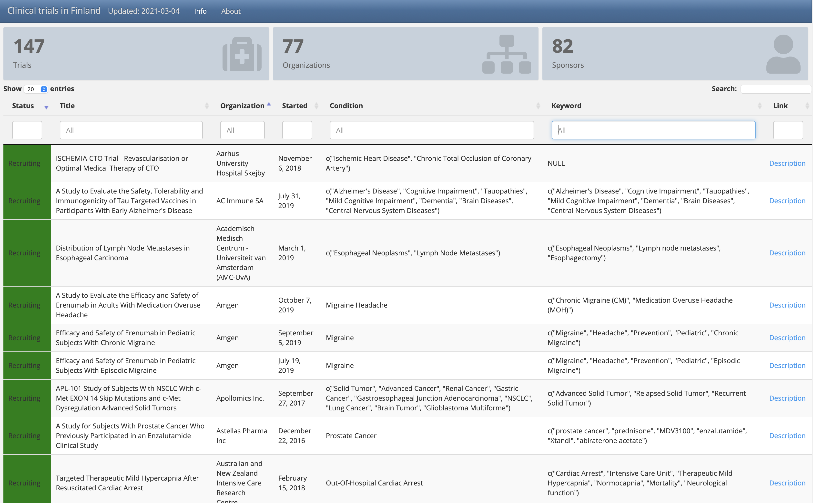
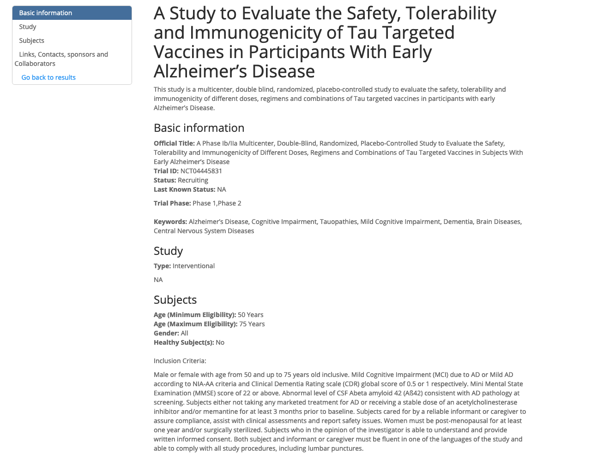

## Clinical trials in Finland

Workflow to get data from clinicaltrials.gov and list information to a Webpage.

Search clinical trials from [clinicaltrial.gov](https://clinicaltrials.gov/api/) and render results to a webpage. Detailed descriptions are available from all result.

### [Example site](https://research.janimiettinen.fi/material/clinicaltrials/)

## Screenshots

## How to use

1. Edit your search criteria. File `doc/conditions.csv` has to column criterias and study numbers. R script `CONFIG.R` reads that file and creates BASE_URL for search. If you want to change Location, edit line according in `CONFIG.R`.

2. Use `RUN.R` for creating the webpage. Webpage comes to `output/`-folder.

## Notes

- [TODO-list](TODO.md)
